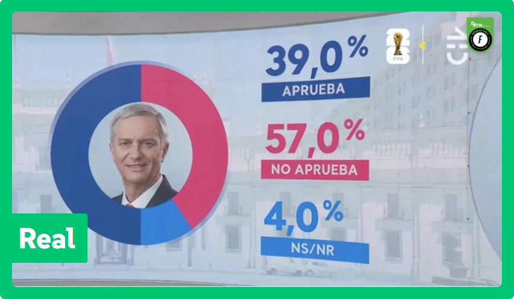

```{r}
library(surveydown)
```

--- bienvenida

# Prueba diagnóstica: Aproximación a las Políticas Públicas desde los Datos

Esta prueba tiene como objetivo medir el nivel de conocimiento inicial de cada estudiante en tres dimensiones: estadística, programación y políticas públicas. Esta prueba NO posee calificación alguna, su importancia radica en la necesidad de medir el conocimiento base para adaptar de la mejor manera posible la dinámica de las clases y tutorías.

```{r}
sd_nav(show_previous = FALSE, label_next = "Ir a identificación")
```

--- identificacion

# Identificación

```{r}
sd_question(
  id = "identificacion_nombre_completo",
  type = "text",
  label = "Ingrese su nombre completo"
)
```

```{r}
sd_question(
  id = "identificacion_rut",
  type = "text",
  label = "Ingrese su RUT (sin puntos ni guión)"
)
```

```{r}
sd_nav(label_next = "Comenzar diagnóstico")
```

--- estadistica

# Estadística

```{r}
sd_question(
  id = "q04_estadistica",
  type = "mc",
  label = "¿Qué mide la desviación estándar?",
  option = c(
    "a) El valor promedio de los datos" = "a",
    "b) La relación entre dos variables" = "b",
    "c) La distancia de los valores respecto a la media" = "c",
    "d) La diferencia entre el valor máximo y mínimo de los datos" = "d"
  )
)
```

```{r}
sd_question(
  id = "q05_estadistica",
  type = "mc",
  label = "Si una variable tiene valores muy extremos (outliers), ¿qué medida de tendencia central es más robusta?",
  option = c(
    "a) Media" = "a",
    "b) Mediana" = "b",
    "c) Moda" = "c",
    "d) Varianza" = "d"
  )
)
```

```{r}
sd_question(
  id = "q06_estadistica",
  type = "mc",
  label = "Una distribución de datos que posee una  asimetría positiva",
  option = c(
    "a) Tiene sus datos concentrados en torno al promedio" = "a",
    "b) Posee una cola hacia la derecha" = "b",
    "c) Tiene sus datos dispersos en torno al promedio" = "c",
    "d) Posee una cola hacia la izquierda" = "d"
  )
)
```

```{r}
sd_question(
  id = "q09_estadistica",
  type = "mc",
  label = "¿Cuál sería un ejemplo de variable con distribución de poisson?",
  option = c(
    "a) Temperatura" = "a",
    "b) Números de robos en una esquina" = "b",
    "c) Promedio de ingresos para la región de Aysén" = "c",
    "d) Bebés prematuros en Chile para el 2025" = "d"
  )
)
```

```{r}
sd_nav(label_next = "Continuar")
```

--- politicas_publicas

# Políticas públicas

```{r}
sd_question(
  id = "q07_politicas_publicas",
  type = "mc",
  label = "¿Qué busca identificar una evaluación de impacto?",
  option = c(
    "a) El costo total de una política" = "a",
    "b) Si los cambios observados se deben a la intervención" = "b",
    "c) La satisfacción de los beneficiarios de la iniciativa" = "c",
    "d) Medidas para mejorar la implementación de la intervención" = "d"
  )
)
```

## Observa la siguiente figura

{fig-align="center" width="70%"}

```{r}
sd_question(
  id = "q10_politicas_publicas",
  type = "mc",
  label = "¿Cuál es el error qué aparece en el siguiente gráfico?",
  option = c(
    "a) Los porcentajes no suman 100" = "a",
    "b) No hay errores en la figura" = "b",
    "c) Los colores del área están mal distribuidas" = "c",
    "d) Errores ortográficos" = "d"
  )
)
```

```{r}
sd_nav(label_next = "Continuar")
```

--- programacion

# Programación

```{r}
sd_question(
  id = "q01_programacion",
  type = "mc",
  label = "¿Qué hace la siguiente línea de código? \"x <- 5\"",
  option = c(
    "a) Compara si x es igual a 5" = "a",
    "b) Asigna el valor 5 a x" = "b",
    "c) Genera una suma hasta 5" = "c",
    "d) Genera un objeto de largo 5" = "d"
  )
)
```

```{r}
sd_question(
  id = "q02_programacion",
  type = "mc",
  label = "¿Cuál de los siguientes es un objeto válido en R para almacenar una lista de números?",
  option = c(
    "a) vector(1,2,3)" = "a",
    "b) list[1,2,3]" = "b",
    "c) v(1,2,3)" = "c",
    "d) c(1,2,3)" = "d"
  )
)
```

```{r}
sd_question(
  id = "q03_programacion",
  type = "mc",
  label = "¿Cuál es el resultado de la siguiente operación? \" 'hola' + 1\"",
  option = c(
    "a) Error" = "a",
    "b) hola + 1" = "b",
    "c) hola1" = "c",
    "d) hola" = "d"
  )
)
```

```{r}
sd_question(
  id = "q08_programacion",
  type = "mc",
  label = "Si tengo vectores numéricos con distinta cantidad de valores (largo) al sumarlos. ¿Se genera algún error?",
  option = c(
    "a) No. R no tiene problemas con vectores de distinto largo." = "a",
    "b) Me genera un error, pues no puedo sumar vectores de distinto largo." = "b",
    "c) Ejecuta la suma, pero con un mensaje de advertencia indicando una dedición tomada." = "c",
    "d) Ninguna de las anteriores." = "d"
  )
)
```

```{r}
sd_nav(label_next = "Continuar")
```

--- cierre

# ¡Gracias por responder!

```{r}
sd_nav(show_previous = FALSE, show_next = FALSE)
```

```{r}
sd_close(label_close = "Terminar", show_previous = FALSE)
```

